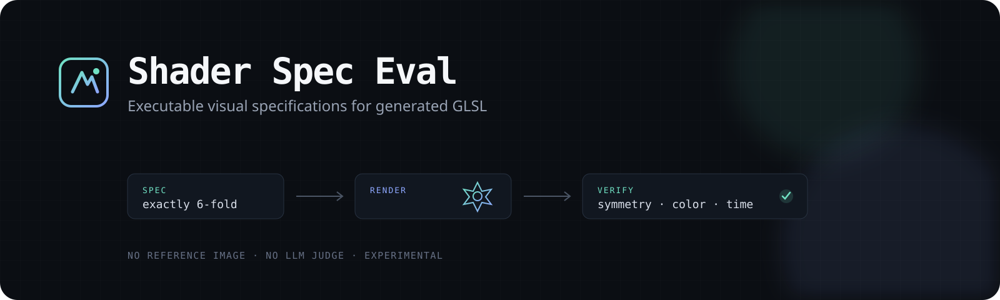
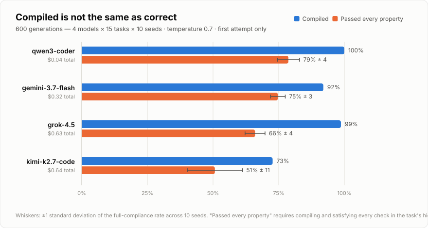

<p align="center">
  
</p>

# Shader Spec Eval

An experimental evaluation for asking a narrow question: **can a language model turn a
visual specification into a shader that behaves correctly?**

The model receives requirements such as “draw exactly an 8×8 checkerboard” or “produce a
six-fold cyan pattern that rotates with time.” Its GLSL is rendered headlessly, then checked
against measurable properties: repetition, symmetry, radius, color, edge sharpness, animation,
and stability. There is no reference-image diff and no LLM judge.

> This is an early benchmark prototype, not a definitive leaderboard. The goal is to publish
> the method, the failures, and the grader itself so other people can test and improve it.

## Why another shader evaluation?

[ShaderEval](https://huggingface.co/datasets/Vipitis/Shadereval-inputs) evaluates completion of
functions taken from existing Shadertoy programs. Shader Spec Eval starts from behavioral natural
language and accepts any implementation that satisfies the rendered requirements.

That distinction matters because visual programs rarely have one correct source file or one exact
pixel arrangement. Exact matching rejects valid alternatives; compilation accepts attractive but
incorrect output. This project treats rendered properties like unit tests for visual code.

## Current task ladder

| Group | Tasks | Core behavior |
|---|---|---|
| Gradients | `gradient`, `gradient-diagonal` | Direction and time stability |
| Repetition | `bands`, `stripes`, `tile`, `grid` | Exact counts, axes, and edges |
| Geometry | `sdf`, `offset-circle`, `ring`, `box`, `double-circle` | Position, bounds, and radii |
| Symmetry/time | `mirror`, `pulse`, `motion`, `polar` | Symmetry, direction, animation, angular order |

## Quick start

Requirements: Python 3.10+, Chromium installed through Playwright, and either Ollama or a supported
hosted model API.

```bash
git clone https://github.com/Husienvora/shader-spec-eval.git
cd shader-spec-eval
python -m venv .venv
```

Activate the environment:

```bash
# Linux/macOS
source .venv/bin/activate

# Windows PowerShell
.venv\Scripts\Activate.ps1
```

Install the package and renderer:

```bash
pip install -e .
python -m playwright install chromium
shader-spec-eval doctor
```

Before evaluating a model, validate the grader:

```bash
shader-spec-eval selftest
```

The self-test renders known-good shaders and deliberately broken controls, including a square
masquerading as a circle, 4×4 and 16×16 checkerboards, inverted radial falloff, periodic animation,
and incorrect rotational orders.

## Run a local model

```bash
ollama pull qwen2.5-coder:14b
shader-spec-eval --temperature 0.7 --seed 7 run \
  --models qwen2.5-coder:14b \
  --repeats 3 \
  --no-open
```

Temperature and seed are explicit. Repeat 1 uses seed 7, repeat 2 uses seed 8, and so on. Both are
stored in every raw result cell.

## Run hosted or OpenAI-compatible models

```bash
# Gemini direct
export GEMINI_API_KEY=...
shader-spec-eval run --models gemini:gemini-2.5-flash --repeats 3

# OpenRouter
export OPENROUTER_API_KEY=...
shader-spec-eval run --models openrouter:google/gemini-3.7-flash --repeats 3

# LM Studio, llama.cpp, vLLM, or another compatible local server
export OPENAI_API_KEY=local
shader-spec-eval run \
  --models openai:my-model@http://127.0.0.1:1234/v1 \
  --repeats 3
```

Several models can be evaluated in the same run:

```bash
shader-spec-eval run --models \
  qwen2.5-coder:14b \
  gemini:gemini-2.5-flash \
  openrouter:google/gemini-3.7-flash \
  --repeats 5
```

Provider model names change over time; use names currently available to your account.

The preregistered study has a catalog preflight, pilot mode, hard cost ceiling, and automatic
resume. See the [OpenRouter runbook](docs/openrouter-runbook.md); without `--execute`, it makes no
paid requests.

## Outputs and scores

Each run writes:

- `results/latest/shader-cells.json`: prompts' outputs, property verdicts, render PNGs, timings,
  temperature, seeds, compile logs, and transient-error status.
- `results/latest/shader-dashboard.html`: a self-contained visual report.

Two numbers answer different questions:

- **Property score:** mean fraction of individual requirements satisfied.
- **Clean completion:** shaders satisfying every property.

Do not describe property score as task accuracy. A shader can compile and satisfy generic sanity
checks while failing its central spatial requirement.

## Frozen-run results (temperature-controlled-v0.3)

<picture>
  <source media="(prefers-color-scheme: dark)" srcset="assets/results-v0.3-dark.svg">
  
</picture>

First controlled run: 4 hosted routes × 15 tasks × 10 seeds (600 generations), temperature 0.7,
no provider fallback, no compiler repair, first attempt only.

- **90.8%** of generations compiled; **67.5%** passed every property in their spec.
- The top two models sit within about one seed-standard-deviation of each other — treat large
  gaps as meaningful, not adjacent ranks.
- Simple shapes were nearly solved (grid/box/sdf ≈ 98% clean); exact geometry was the wall
  (stripes 38%, ring 25%, mirror 3%, offset-circle 0%). The single most-failed check was
  `sharp_edges` — 128 compiled shaders drew soft boundaries where the spec demanded hard ones.
- Raw cells, dashboard, and run config:
  [`results/frozen-temperature-v0.3`](results/frozen-temperature-v0.3). The chart is generated by
  `scripts/render-results-chart.mjs`.

## First local finding

The included exploratory run used `qwen2.5-coder:14b`, temperature `0.7`, seeds `7/8/9`, five
tasks, and three repeats:

- 87.84% mean property compliance
- 5/15 clean shader completions
- 15/15 compiled
- 3.36-point within-model standard deviation across full-ladder repeats

See [`results/sample-qwen2.5-coder-14b`](results/sample-qwen2.5-coder-14b). This is a single-model
pilot, not evidence for comparative model rankings.

## Documentation

- [Evaluation design](docs/evaluation-design.md)
- [Research plan and temperature-controlled model policy](docs/research-plan.md)
- [OpenRouter pilot, full-run, and resume checklist](docs/openrouter-runbook.md)
- [Pre-results research paper draft](paper/paper.md)
- [Motion Canvas video visuals and export guide](video/visuals/README.md)
- [Adding a task or property](docs/adding-tasks.md)
- [Reproducible runs and result submissions](docs/reproducibility.md)
- [Contributing](CONTRIBUTING.md)

## Known limitations

- Fifteen tasks are still too few for a definitive leaderboard.
- The current checks measure behavioral compliance, not aesthetics or creativity.
- Passing does not prove a model “reasoned”; it proves its output met sampled properties.
- Properties and thresholds can have false positives and false negatives.
- Compilation repair gives one feedback-assisted retry after a hard syntax failure.
- Comparative reliability and construct validity require more models, tasks, and repeated runs.
- The prompt asks for an SDF, but rendered pixels cannot prove which internal formula was used.

## Prior work

This project is different from—but indebted to—work on graphics-code completion and shader
generation. In particular, see
[Evaluating Language Models for Computer Graphics Code Completion](https://doi.org/10.1109/LLM4Code66737.2025.00017)
and its [ShaderEval dataset](https://huggingface.co/datasets/Vipitis/Shadereval-inputs).

## License

MIT. Shadertoy-style task prompts and the project-authored reference/control shaders are included
under the repository license.
